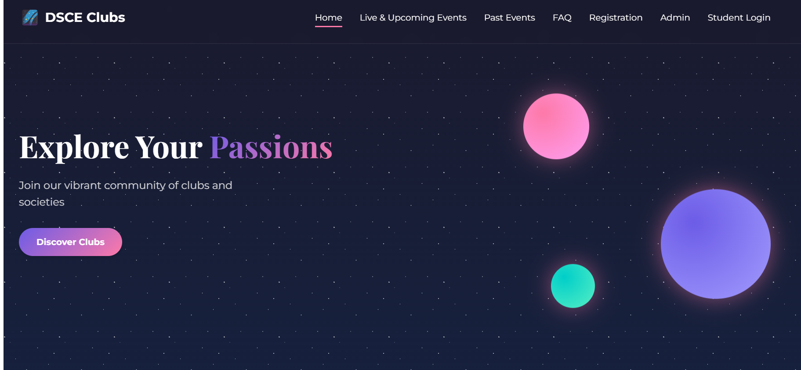
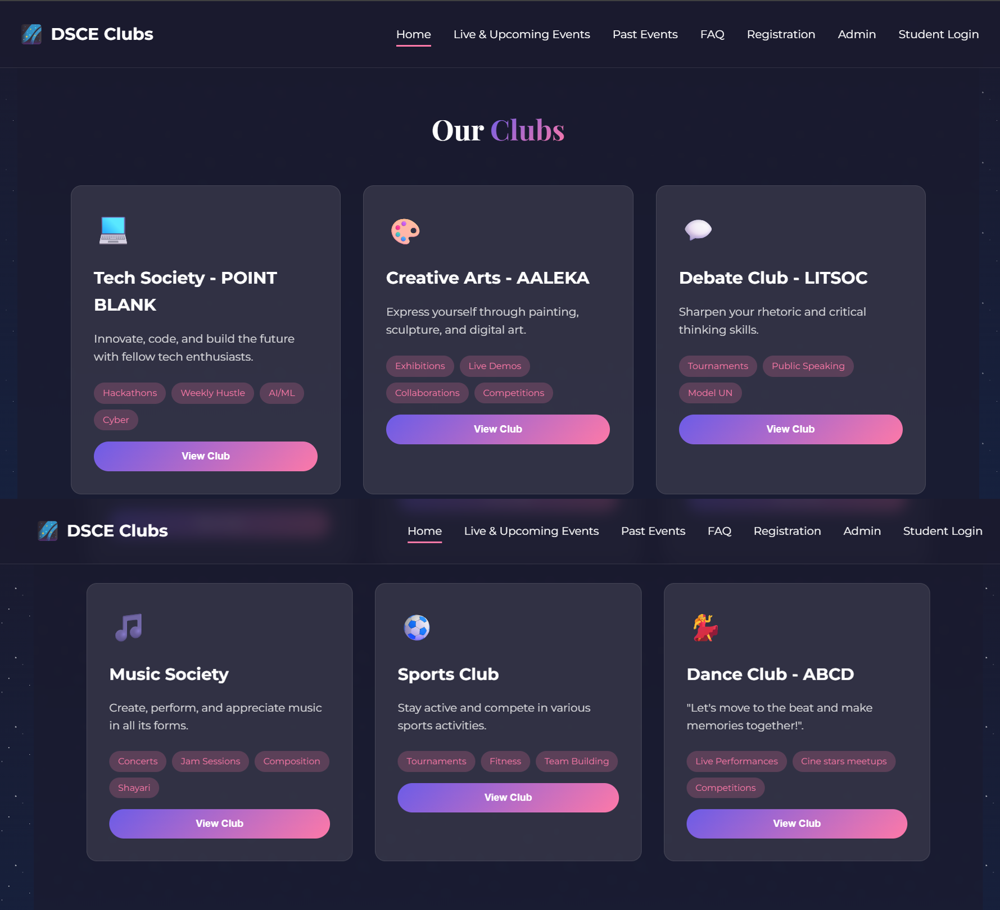
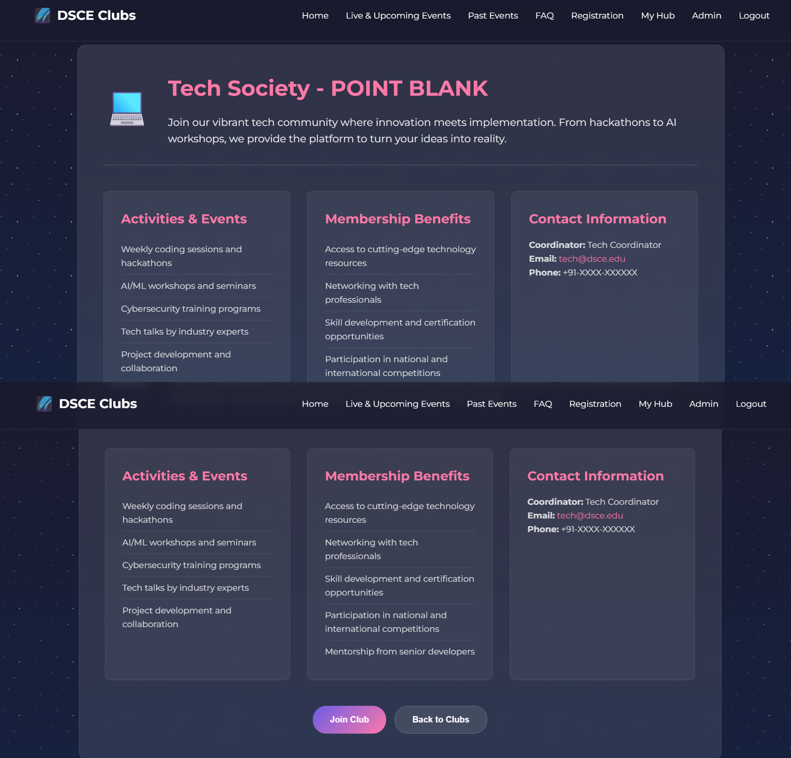

<div align="center">

# 🎓 DSCE Clubs  
### Centralized Club Management Platform

<p align="center">
A modern, lightweight, and open-source web platform for managing clubs, events, and campus communication.
</p>

<p align="center">
  
  
  
</p>

</div>

---

## 📑 Table of Contents
- [About The Project](#-about-the-project)
- [Problem Statement](#-problem-statement)
- [Solution](#-solution)
- [Key Features](#-key-features)
- [Screenshots](#-screenshots)
- [Tech Stack](#-tech-stack)
- [Project Structure](#-project-structure)
- [Getting Started](#-getting-started)
- [Usage Guide](#-usage-guide)
- [Contributing](#-contributing)
- [Accessibility](#-accessibility)
- [Roadmap](#-roadmap)
- [License](#-license)
- [Acknowledgements](#-acknowledgements)

---

## 📖 About The Project

**DSCE Clubs** is a web-based platform designed to simplify **club management, event coordination, and campus communication** within educational institutions.  
It provides a **single interface** for students, club leads, and faculty administrators—ensuring transparency and smooth coordination of campus activities.

---

## ❗ Problem Statement

Educational institutions often face:

- Fragmented club information across multiple platforms  
- Inefficient event registration workflows  
- Missed announcements and poor reach  
- Lack of centralized faculty oversight  

### ✅ Solution

**DSCE Clubs** centralizes all club-related activities under **one accessible and transparent system**.

---

## ✨ Key Features

<details>
<summary><strong>👩‍🎓 Student Module</strong></summary>

- Browse and explore clubs  
- View upcoming and past events  
- Register for events seamlessly  
- Receive announcements and updates  
- FAQ page for common questions  
- View club details  
- Add clubs to favourites ❤️

</details>

<details>
<summary><strong>🧑‍💼 Club Admin / Lead Module</strong></summary>

- Manage club members  
- Create, update, and manage events  
- Publish announcements and notices  
- Maintain club records  

</details>

<details>
<summary><strong>👨‍🏫 Faculty / Super Admin Module</strong></summary>

- Oversee all clubs and activities  
- Review and approve events  
- Coordinate campus-wide initiatives  
- Ensure transparency and compliance  

</details>

---

## 🖼️ Screenshots





---

## 🛠 Tech Stack

| Category | Technologies |
|--------|-------------|
| Frontend | HTML5, CSS3 |
| Scripting | Vanilla JavaScript |
| Styling | Custom CSS |
| Backend | Node.js, SQLite |
| Version Control | Git & GitHub |

> 🎯 Lightweight, fast, and beginner-friendly.

---

## 📁 Project Structure

```bash
club-hub/
├── admin-dashboard.html
├── admin-login.html
├── admin.css
├── app.js
├── club.html
├── CODE_OF_CONDUCT.md
├── CONTRIBUTING.md
├── events.html
├── faq.html
├── index.html
├── LICENSE
├── my-hub.html
├── package.json
├── past-events.html
├── README.md
├── registration.html
├── SECURITY.md
├── style.css
└── backend/
    ├── .env
    ├── server.js
    ├── database.sqlite
    ├── add_admin.js
    ├── controllers/
    ├── models/
    └── routes/
└── assets/
    └── screenshots/
        ├── home_page.png
        ├── club.png
        └── view_club.png
```

## ⚙️ Getting Started

### Prerequisites

- Modern web browser (Chrome, Firefox, Edge, Safari)
- Node.js (v14 or higher)
- npm

---

### Installation & Setup

#### Clone the repository

```bash
git clone https://github.com/<your-username>/club-hub.git
cd club-hub
```

### Setup the backend:

```bash
cd backend
npm install
npm start
```


Open index.html in your browser (or use VS Code Live Server).

Running Tests

```bash
npm install
npm test
```

### 🧪 Usage Guide

Navigate the UI as a student

Explore clubs & events

Access admin functionality

Extend features by modifying JS/CSS

### 🤝 Contributing

We welcome contributions from all experience levels 💙

Please read CONTRIBUTING.md before contributing.

### Contribution Flow
```bash
git checkout -b feature/your-feature
git commit -m "feat: meaningful description"
git push origin feature/your-feature
```

### Open a Pull Request 🚀

### ♿ Accessibility

- Added Skip to main content link for keyboard users
- Mobile menu is a proper button with aria-label, aria-expanded, and aria-controls
- Navigation list uses aria-hidden when closed, reachable via Tab when opened
- Strong focus styles for links, buttons, and CTAs
- Keyboard handling: Enter/Space toggles menu, Esc closes it, Arrow keys navigate
- Manual testing: Tab through site, check visible focus, press Esc to close menu

### 🗺 Roadmap
- Backend integration
- Role-based authentication
- Analytics dashboard
- Mobile responsiveness
- Accessibility improvements

### 🏷 Open Source Program 🌱 Social Winter of Code (SWoC) 2026

- Beginner-friendly issues
- UI/UX improvements
- Documentation contribution
- Feature proposals

### 📄 License

Licensed under the repository’s [LICENSE](LICENSE) file.

### 🙌 Acknowledgements

- SWoC 2026 mentors & maintainers
- Open-source contributors
- Student developer community

<div align="center"> ⭐ If you like this project, don’t forget to star the repository! Happy Contributing 🚀 </div>
