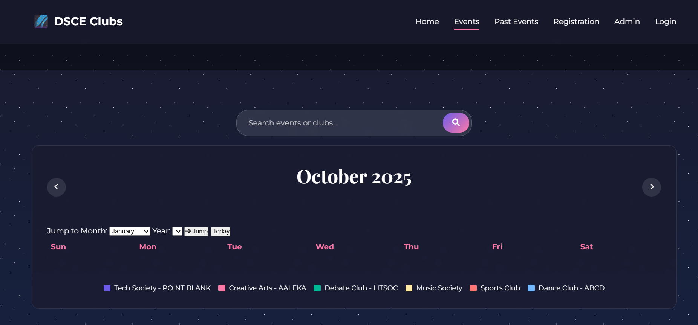

<div align="center">

# 🎓 ClubHub  
### Centralized Club Management Platform

<p align="center">
A modern, lightweight, and open-source web platform for managing clubs, events, and campus communication.
</p>

<p align="center">
  
  
  
</p>

</div>

---

## 📖 About The Project

**ClubHub** is a centralized, web-based platform designed to simplify **club management, event coordination, and campus communication** within educational institutions.

It offers a **single, unified interface** for students, club leads, and faculty administrators—ensuring transparency, accessibility, and smooth coordination of campus activities.

---

## ❗ Problem Statement

Educational institutions often face:

- Fragmented club information across multiple platforms  
- Inefficient event registration workflows  
- Missed announcements and poor reach  
- Lack of centralized faculty oversight  

### ✅ Solution

**ClubHub** brings all club-related activities under **one structured, accessible, and transparent system**.

---

## ✨ Key Features

<details>
<summary><strong>👩‍🎓 Student Module</strong></summary>

- Browse and explore clubs  
- View upcoming and past events  
- Register for events seamlessly  
- Receive announcements and updates  

</details>

<details>
<summary><strong>🧑‍💼 Club Admin / Lead Module</strong></summary>

- Manage club members  
- Create, update, and manage events  
- Publish announcements and notices  
- Maintain club records  

</details>

<details>
<summary><strong>👨‍🏫 Faculty / Super Admin Module</strong></summary>

- Oversee all clubs and activities  
- Review and approve events  
- Coordinate campus-wide initiatives  
- Ensure transparency and compliance  

</details>

---

## 🖼️ Screenshots

> 📌 Upload screenshots inside: `assets/screenshots/`

| Home | Events | Admin |
|------|--------|-------|
|  |  |  |

---

## 🛠 Tech Stack

| Category | Technologies |
|--------|-------------|
| Frontend | HTML5, CSS3 |
| Scripting | Vanilla JavaScript |
| Styling | Custom CSS |
| Version Control | Git & GitHub |

> 🎯 Designed to be **lightweight, fast, and beginner-friendly**.

---

## 📁 Project Structure

```bash
club-hub/
├── assets/
│   └── screenshots/
├── index.html
├── events.html
├── past-events.html
├── registration.html
├── admin-login.html
├── admin.css
├── admin.js
├── app.js
├── style.css
├── README.md
└── CONTRIBUTING.md
```
---

## ⚙️ Getting Started
### Prerequisites
- Modern web browser (Chrome, Firefox, Edge, Safari)
- No backend or database required

### Installation & Setup
```bash
- git clone https://github.com/<your-username>/club-hub.git
- cd club-hub
- open index.html
```

---

## 🧪 Usage Guide 
- Navigate through the UI as a student
- Explore clubs & events
- Access admin functionality
- Extend features by modifying JS/CSS

 ---

## 🤝 Contributing

We welcome contributions from all experience levels 💙


📌 Please read **CONTRIBUTING.md** before contributing.

### Contribution Flow
```bash
git checkout -b feature/your-feature
git commit -m "feat: meaningful description"
git push origin feature/your-feature
```
Open a Pull Request 🚀

--- 
## 🗺 Roadmap

- Backend integration
- Role-based authentication
- Analytics dashboard
- Mobile responsiveness
- Accessibility improvements
 ---

## 🏷 Open Source Program
## #🌱 Social Winter of Code (SWoC) 2026

This project encourages:
- Beginner-friendly issues
- UI/UX improvements
- Documentation contributions
- Feature proposals

--- 

## 📄 License
Licensed under the repository’s license.
All contributions follow the same terms.

--- 

## 🙌 Acknowledgements
- SWoC 2026 mentors & maintainers
- Open-source contributors
- Student developer community

--- 

<div align="center">
⭐ If you like this project, don’t forget to star the repository!

Happy Contributing 🚀
</div> 
